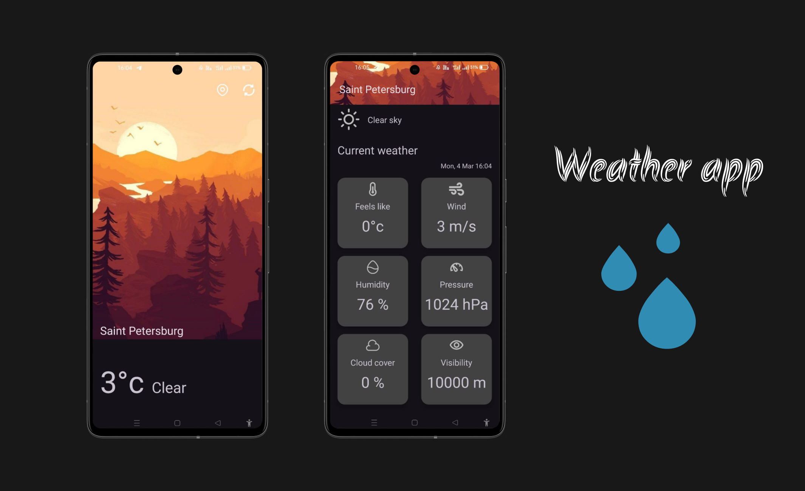

# Weather App
#### Project in progress...
_______________
### App Preview

_______________
### Tech stack
+ #### Kotlin
+ #### Clean Architecture
+ #### MVVM (Model-View-ViewModel)
+ #### Retrofit2 - API interaction
+ #### OkHttp - using OkHttp client
+ #### Gson - used for converting JSON objects
+ #### Coroutines - used for writing asynchronous code
+ #### Flow - used for streaming data that can be computed asynchronously
+ #### Koin - dependency injection framework
+ #### Room - local data storage
+ #### LiveData - data container that supports observing changes
+ #### ViewModel - stores UI-related data
+ #### Navigation - used for navigation between fragments
+ #### Glide - used for working with images

